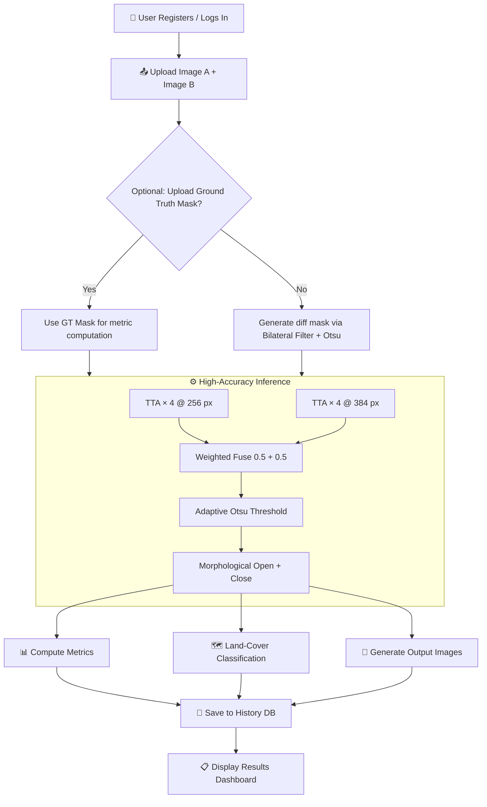

<div align="center">

# 🛰️ Satellite Images Change Detection


**A deep learning–powered web application that detects and analyses changes between two satellite images using a custom ChangeFormerV2 architecture (CNN + Transformer hybrid).**

[Features](#-features) · [Architecture](#-architecture) · [Installation](#-installation) · [Usage](#-running-the-application) · [Workflow](#-detailed-workflow) · [API](#-api-routes) · [Structure](#-project-structure)

</div>

---

## ✨ Features

| Feature | Description |
|---|---|
| 🤖 **Deep Learning Inference** | Custom ChangeFormerV2 (CNN + Transformer hybrid) pre-trained on satellite imagery |
| 🔁 **Test-Time Augmentation (TTA)** | 4 augmented passes (original, H-flip, V-flip, HV-flip) averaged for robust predictions |
| 🔭 **Multi-Scale Inference** | Runs at 256 px and 384 px, fused with weighted averaging to catch both coarse and fine-detail changes |
| 🎯 **Adaptive Otsu Thresholding** | Automatically finds the optimal binarisation threshold; falls back to user-defined sensitivity |
| 🗺️ **Land-Cover Classification** | HSV-based heuristic classifier identifies Forest, Water, Urban, Agricultural, and Barren regions |
| 📊 **Comprehensive Metrics** | Accuracy, Sensitivity, Specificity, Precision, F1-Score, IoU, MCC, Balanced Accuracy |
| 🧠 **XAI Heatmap** | Probability heatmap overlaid on imagery for visual explainability |
| 🔲 **Contour Overlay** | Green contour boundary drawn on changed regions |
| 👤 **User Authentication** | Register / Login / Logout with session management |
| 📜 **Analysis History** | All detections saved per-user with full metrics and image thumbnails |
| ⚙️ **Settings Panel** | Configurable sensitivity threshold and preferences |
| 🗄️ **SQLite Database** | Lightweight, zero-config local database (`app.db`) |

---

## 🏗️ Architecture

### ChangeFormerV2 Model

```
┌─────────────────────────────────────────────────────────────┐
│                    ChangeFormerV2                           │
├────────────────────────┬────────────────────────────────────┤
│  CNN Encoder (Shared)  │   Transformer Bridge               │
│  ──────────────────    │   ──────────────────               │
│  Conv 3→64   (enc1)    │   4-layer TransformerEncoder       │
│  Conv 64→128 (enc2)    │   d_model=256, nhead=8             │
│  Conv 128→256 (enc3)   │   2D SinCos Positional Embedding   │
├────────────────────────┴────────────────────────────────────┤
│  Difference Features: |F_A - F_B| at each encoder scale    │
├─────────────────────────────────────────────────────────────┤
│  CNN Decoder (Skip Connections)                             │
│  ConvTranspose 256→128 → concat skip → Conv                │
│  ConvTranspose 128→64  → concat skip → Conv                │
│  Final Conv 64→1 + Sigmoid → Change Probability Map        │
└─────────────────────────────────────────────────────────────┘
```

### Inference Pipeline

```
Image A ──┐
          ├─► [TTA × 4 @ 256px] ──┐
Image B ──┘                        ├─► Weighted Fuse ─► Adaptive Threshold ─► Binary Mask
          ├─► [TTA × 4 @ 384px] ──┘          ↓
          └──────────────────────  Morphological Open + Close (noise removal)
                                              ↓
                               Metrics · Land-Cover · Heatmap · Contours
```

---

## 📦 Requirements

### System Requirements

| Requirement | Minimum | Recommended |
|---|---|---|
| OS | Windows / macOS / Linux | Windows 10+ / Ubuntu 20.04+ |
| Python | 3.8 | 3.10+ |
| RAM | 4 GB | 8 GB |
| GPU | None (CPU works) | CUDA-capable NVIDIA GPU |

### Python Dependencies

```
flask
numpy
opencv-python
pillow
torch
torchvision
```

> **GPU Support**: Install the CUDA-enabled PyTorch wheel from [pytorch.org](https://pytorch.org/get-started/locally/) **before** running `pip install -r requirements.txt`.

---

## 🚀 Installation

### Step 1 — Clone the Repository

```bash
git clone https://github.com/JAHNAVISINDHU/satelite-images-change-detection.git
cd satelite-images-change-detection
```

### Step 2 — Create a Virtual Environment *(Recommended)*

```bash
# Windows
python -m venv venv
venv\Scripts\activate

# macOS / Linux
python3 -m venv venv
source venv/bin/activate
```

### Step 3 — Install Dependencies

```bash
pip install -r requirements.txt
```

> 💡 **GPU Users** — Install a CUDA-compatible PyTorch build first:
> ```bash
> # Example for CUDA 12.1
> pip install torch torchvision --index-url https://download.pytorch.org/whl/cu121
> ```

### Step 4 — Verify the Pre-trained Model

Ensure `best_model.pth` is present in the project root (~18 MB):

```
satelite-images-change-detection/
├── best_model.pth   ← required
├── app.py
└── ...
```

---

## ▶️ Running the Application

### Option A — Direct Python (Cross-platform)

```bash
python app.py
```

### Option B — Windows Batch Script (One-click)

```cmd
run.bat
```

### Option C — Flask CLI

```bash
flask --app app run --host=0.0.0.0 --port=5000
```

Once running, open your browser at:

```
http://127.0.0.1:5000
```

---

## 🔄 Detailed Workflow



### Step-by-Step Breakdown

| Step | What Happens |
|---|---|
| **1. Upload** | Two satellite images uploaded; optionally a binary ground-truth mask |
| **2. Pre-process** | Images resized to 256 × 256, normalised to `[0, 1]` |
| **3. TTA @ 256 px** | 4 forward passes (original + H-flip + V-flip + HV-flip) averaged |
| **4. TTA @ 384 px** | Same 4 passes at higher resolution, resized back to 256 |
| **5. Fusion** | `prob = 0.5 × prob_256 + 0.5 × prob_384` |
| **6. Thresholding** | Adaptive Otsu picks threshold; user can override via slider |
| **7. Morphology** | Elliptical Open + Close kernel removes noise and fills holes |
| **8. Metrics** | Accuracy, Precision, Recall, F1, IoU, MCC, Balanced Accuracy computed |
| **9. Land-Cover** | Changed pixels classified into 5 categories via HSV analysis |
| **10. Visualisation** | Heatmap, binary mask, and green contour overlay saved as PNGs |
| **11. Persist** | Full result record stored in SQLite `history` table |

---

## 🌍 Land-Cover Categories

The classifier analyses HSV colour space to label changed pixels:

| Category | HSV Signature |
|---|---|
| 🌳 Forest / Vegetation | Hue 35–85°, Saturation > 40 |
| 💧 Water Body | Hue 95–135°, Sat > 50, Value < 180 |
| 🏙️ Urban / Buildings | Saturation < 45, Value > 80 |
| 🌾 Agricultural Land | Hue 25–50°, Sat 40–130 |
| 🏜️ Barren / Soil | Hue 8–30°, Sat ≥ 20, Value > 60 |

---

## 📈 Metrics Explained

| Metric | Formula | What It Measures |
|---|---|---|
| **Accuracy** | (TP+TN) / Total | Overall correct predictions |
| **Sensitivity** | TP / (TP+FN) | How well it detects real changes (Recall) |
| **Specificity** | TN / (TN+FP) | How well it avoids false alarms |
| **Precision** | TP / (TP+FP) | Quality of detected change pixels |
| **F1-Score** | 2·P·R / (P+R) | Harmonic mean of Precision and Recall |
| **IoU** | TP / (TP+FP+FN) | Overlap ratio (Jaccard Index) |
| **MCC** | (TP·TN−FP·FN)/√… | Balanced metric robust to class imbalance |
| **Balanced Accuracy** | (Sensitivity+Specificity)/2 | Average of class-wise accuracies |

---

## 🗂️ Project Structure

```
satelite-images-change-detection/
├── app.py                  # Main Flask application (routes, model, inference)
├── best_model.pth          # Pre-trained ChangeFormerV2 checkpoint (~18 MB)
├── requirements.txt        # Python dependencies
├── run.bat                 # Windows one-click launcher
├── app.db                  # SQLite database (auto-generated on first run)
├── inspect_db.py           # Utility script to inspect the database
├── train_colab.py          # Training script for Google Colab
├── templates/
│   ├── base.html           # Base layout with navbar and sidebar
│   ├── login.html          # Login page
│   ├── register.html       # Registration page
│   ├── dashboard.html      # Main inference and results page
│   ├── history.html        # Analysis history per user
│   ├── settings.html       # User settings and threshold control
│   └── train.html          # Training interface
└── static/
    └── results/            # Output images saved here (auto-created)
```

---

## 🌐 API Routes

| Method | Route | Auth Required | Description |
|---|---|---|---|
| `GET` | `/` | No | Redirects to dashboard (if logged in) or login |
| `GET/POST` | `/register` | No | User registration |
| `GET/POST` | `/login` | No | User login |
| `GET` | `/logout` | Yes | Session clear and redirect |
| `GET/POST` | `/dashboard` | Yes | Main change detection interface |
| `GET` | `/history` | Yes | User's analysis history |
| `GET` | `/settings` | Yes | User settings page |

---

## 🔧 Configuration

| Parameter | Default | Description |
|---|---|---|
| `DEFAULT_THRESHOLD` | `0.30` | Fallback binarisation threshold |
| `UPLOAD_FOLDER` | `static/results` | Where result images are stored |
| `app.secret_key` | `super_secret_key_demo` | Flask session secret |
| Sensitivity Slider | `0.15 – 0.65` | User-adjustable via the dashboard UI |

> ⚠️ **Security Note**: Before deploying to production, replace `app.secret_key` with a strong random value and add password hashing (e.g., `bcrypt`).

---

## 🤝 Contributing

1. Fork the repository
2. Create a feature branch: `git checkout -b feature/your-feature`
3. Commit your changes: `git commit -m "feat: add your feature"`
4. Push to the branch: `git push origin feature/your-feature`
5. Open a Pull Request

---

## 📄 License

This project is licensed under the **MIT License** — see the [LICENSE](LICENSE) file for details.

---

<div align="center">
Made with ❤️ using PyTorch + Flask
</div>
